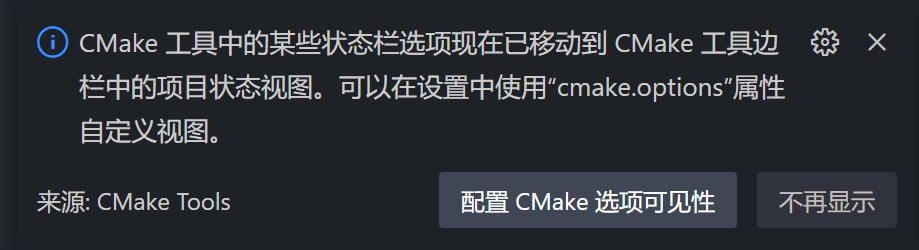
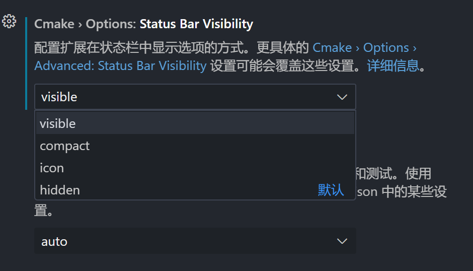
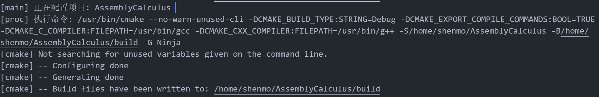
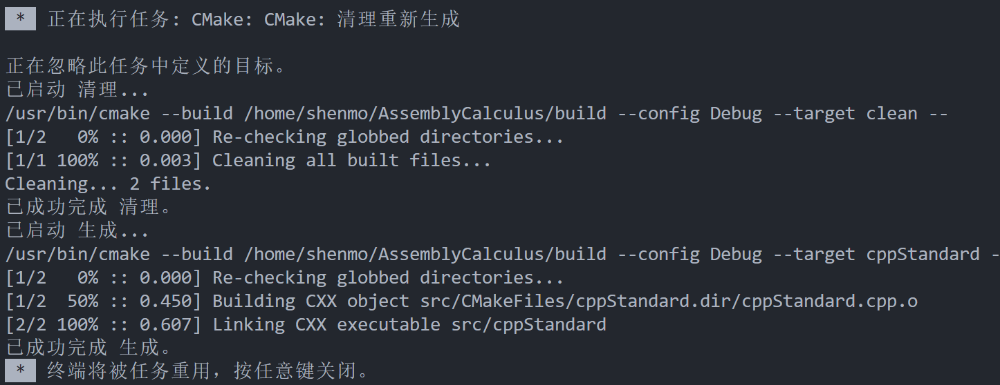
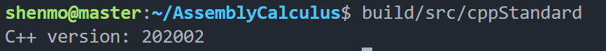

### 准备工作
1. 请提前装好cmake和高版本gcc

* [项目模板使用教程视频](https://www.bilibili.com/video/BV1YG4y1v7uB/?spm_id_from=333.999.0.0&vd_source=fc9e2ce40d62056c65de16d8d9914cbf) 仅需浏览1：38~4：35（强烈建议看一下）
* [ubuntu gcc13.1.0 x86_64-linux-gnu 安装](https://www.cnblogs.com/jamesnulliu/p/5_Steps_to_Use_Cxx20_in_Ubuntu22.html)
* cmake安装: `sudo apt install cmake`


2. 编译控制

前往AssemblyCalculus/CMakeLists.txt调整所需的版本号
```cmake
set(CMAKE_CXX_STANDARD 20)
# set(CMAKE_CXX_STANDARD_REQUIRED ON)
set(CMAKE_C_STANDARD 11)
```

3. 代码文件应当放在include（.hpp）和src文件夹(.cpp)里

### 编译运行流程

在安装好相关插件后，每次进入时都会弹出窗口：


点击配置CMake选项可见性，调成可见：



每次修改完代码后，先使用CMake进行编译，点击下边栏的


一般先选Debug



随后在下边栏的“生成”旁边找到一个 [all] 或者别的什么，点击修改你需要生成可执行文件/文件夹的名称，然后点击生成（直接all当然也行）




最后就可以在终端中运行该文件，这里的代码是在输出C++版本号




### 测试复现

1. 先使用CMake进行编译项目
2. 生成 test
3. 在终端运行即可`~/AssemblyCalculus$` `build/src/test`